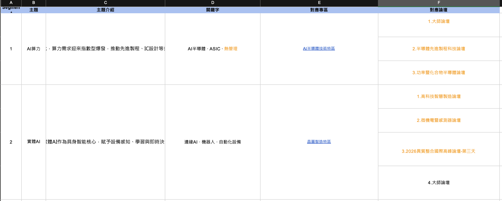
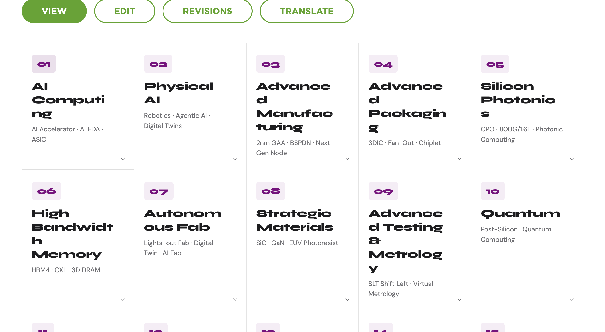

# Trend Table 使用說明

這份工具現在已經改成 `Excel-first` 的工作流：

1. 先在 Excel / Google Sheets 整理 15 大主題資料
2. 直接載入 Excel 檔，或把整塊表格貼進 `Trend Table` 工具
3. 最後只在工具裡做少量校對、預覽、複製 HTML

這樣主資料會留在 Excel，工具本身只負責「匯入、檢查、預覽、輸出」，之後要增減內容、改網址、換論壇、補介紹，都會比較好迭代。

## 1. 你會看到的兩個核心成果

### Excel 是資料母檔



建議把主題、介紹、關鍵字、專區、論壇、連結都先整理在同一份表裡。這份表未來就是最重要的維護來源。

### 網站端輸出是最終結果



工具的目的不是取代 Excel，而是把 Excel 裡的內容快速轉成網站可貼用的 HTML 區塊。

## 2. 目前最推薦的工作流程

### A. 在 Excel 維護資料

優先建議使用固定欄位模板：

- `No`
- `Icon URL`
- `Title ZH`
- `Title EN`
- `Sub ZH`
- `Sub EN`
- `Trend Intro ZH`
- `Trend Intro EN`
- `Keywords ZH`
- `Keywords EN`
- `ZoneN ZH / EN / URL`
- `ForumN ZH / EN / URL`

模板檔位置：

- [trend-table-import-template.xlsx](/Users/lun04/Desktop/SEMI-Tool-Hub/tools/trends/templates/trend-table-import-template.xlsx)
- [trend-table-import-template.tsv](/Users/lun04/Desktop/SEMI-Tool-Hub/tools/trends/templates/trend-table-import-template.tsv)
- [import-schema.md](/Users/lun04/Desktop/SEMI-Tool-Hub/tools/trends/templates/import-schema.md)

### B. 直接載入 Excel 檔，或複製整塊表格

你現在有兩種方式：

- 點 `載入 Excel / CSV`，直接選 `.xlsx` / `.xls` / `.csv` / `.tsv`
- 或是在 Excel 選取整塊資料，直接複製

### C. 貼到工具的 `Excel / 工作表匯入工作台`

工具頁位置：

- [index.html](/Users/lun04/Desktop/SEMI-Tool-Hub/tools/trends/index.html)

貼上後使用：

- `載入 Excel / CSV`：直接讀第一張工作表並套用
- `套用貼上表`：把 Excel 資料匯入目前 15 個主題
- `匯出目前資料表`：把現在工具裡的內容回吐成 TSV，可再貼回 Excel
- `下載 Excel 範本`：直接打開可編輯的 `.xlsx` 母檔模板
- `下載 TSV 範本`：拿乾淨模板重做
- `複製欄位說明`：把 schema 快速貼給同事或 AI

### D. 用右側編輯區只做局部修正

現在工具已經改成：

- 左邊：主題導覽
- 右邊：單一主題 detail panel
- 下方 / 側邊：即時預覽

也就是一次只專注修一個主題，不需要 15 個主題全部展開、反覆來回捲動。

### E. 預覽沒問題後複製 HTML

完成後直接複製：

- `複製中文代碼`
- `Copy English Code`

再貼到測試站 / CMS。

## 3. Excel 支援兩種貼法

## 模式一：固定欄位模板

這是未來最穩定、最適合交接的格式。

優點：

- 欄位固定
- 中英分離清楚
- 專區 / 論壇可以各自帶 URL
- 比較容易做版本差異比對
- 之後最容易接上自動匯入或檔案上傳

## 模式二：目前你正在整理的 grouped Excel

工具也支援你現在這種工作表邏輯：

- `Segment`
- `主題`
- `主題介紹`
- `關鍵字`
- `對應專區`
- `對應論壇`

規則如下：

1. 同一個主題可以跨多列
2. 同一列可以補一筆專區或論壇
3. 工具會自動把同主題的多列合併回同一張卡片
4. 重新貼上同一主題時，舊的專區 / 論壇會先清掉再重建，避免殘留舊資料

## 4. 專區 / 論壇欄位怎麼寫

目前建議格式：

- `中文名稱 | 英文名稱 | URL`

例如：

```text
AI半導體技術特區 | AI Semiconductor Technology Zone | https://example.com/zone
```

也相容舊格式：

```text
AI半導體技術特區 | https://example.com/zone
```

如果只貼中文與 URL，英文名稱可以之後再補。

## 5. 迭代時怎麼維持乾淨

這個工具之後最重要的不是「一次做完」，而是「反覆更新不痛苦」。

建議做法：

1. Excel 永遠是母檔
2. 每次更新都從 Excel 改
3. 改完整塊重貼到工具
4. 工具裡只做最後微調，不把工具當母資料庫

這樣未來：

- 論壇增減
- 專區調整
- 標題改版
- 中英文同步修正
- 網址批次更新

都不需要再回到 15 張卡片逐一人工複製貼上。

## 6. AI 在這裡最適合扮演的角色

目前最安全的定位是：

- `AI 幫補文案`
- `AI 幫整理缺漏`
- `AI 幫把原始資料轉成表格草稿`

不建議一開始就把全部結構完全交給 AI 自由生成，原因是：

- 主題數量固定
- 官網名稱、專區名稱、論壇名稱常有正式寫法
- URL 不能亂改
- 中英內容需要對齊

所以比較好的未來方向是：

1. 先給 AI 原始展會資料
2. AI 產出第一版 Excel 草稿
3. 人工在 Excel 校正正式名稱與連結
4. 再匯入工具產生 HTML

這樣 AI 是加速器，不是黑盒子。

## 7. 交接時請一起給同事的檔案

至少建議交付這幾份：

1. [index.html](/Users/lun04/Desktop/SEMI-Tool-Hub/tools/trends/index.html)
2. [trend-table-import-template.tsv](/Users/lun04/Desktop/SEMI-Tool-Hub/tools/trends/templates/trend-table-import-template.tsv)
3. [import-schema.md](/Users/lun04/Desktop/SEMI-Tool-Hub/tools/trends/templates/import-schema.md)
4. [使用說明.md](/Users/lun04/Desktop/SEMI-Tool-Hub/tools/trends/docs/使用說明.md)

如果未來 Excel 定案，也建議再補：

5. 一份真實可用的 `主題母檔.xlsx`

## 8. 下一步建議

接下來最值得做的不是再加更多小欄位，而是把工具再往這三件事收斂：

1. `整份展會資料的一次性 AI 初稿整理`
2. `更乾淨的單主題工作台`
3. `匯入後差異比對 / 更新確認`

這三件做完，整個更新流程就會很接近你說的 forum generator：資料集中、操作簡單、可反覆迭代。
